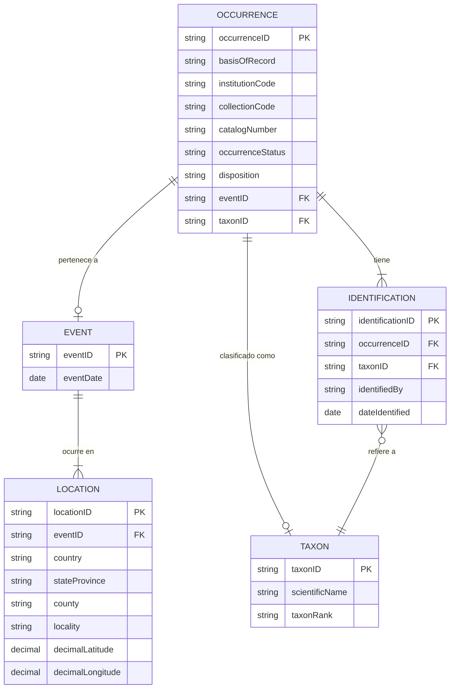

# Sistema de estandarización de datos bajo el estándar Darwin Core
## Colección de Biología del Museo de la Universidad de Antioquia

**Grupo:** Grupo 6 — Ciencias virtual
**Periodo:** 2026-1
**Fecha de análisis:** 20 de April de 2026
**Estándar:** [Darwin Core (TDWG)](https://dwc.tdwg.org/)

---

## Tabla de contenido

1. [Descripción del proyecto](#1-descripción-del-proyecto)
2. [Fase 1 — Análisis y diagnóstico](#2-fase-1--análisis-y-diagnóstico)
   - 2.1 [Revisión de archivos](#21-revisión-de-archivos)
   - 2.2 [Dataset consolidado](#22-dataset-consolidado)
   - 2.3 [Problemas detectados (línea base)](#23-problemas-detectados-línea-base)
3. [Fase 2 — Modelado DwC](#3-fase-2--modelado-dwc)
   - 3.1 [Campos Darwin Core seleccionados](#31-campos-darwin-core-seleccionados)
   - 3.2 [Modelo Entidad-Relación](#32-modelo-entidad-relación)
   - 3.3 [Coincidencia del modelo E-R con los datasets](#33-coincidencia-del-modelo-er-con-los-datasets)
4. [Resumen ejecutivo](#4-resumen-ejecutivo)
5. [Próximos pasos](#5-próximos-pasos)

---

## 1. Descripción del proyecto

El objetivo general es desarrollar un aplicativo que **estandarice y unifique** los datos de la
Colección de Biología del MUA bajo el estándar internacional **Darwin Core (DwC)**.

Este README documenta el trabajo realizado hasta el **21 de abril de 2026**, correspondiente a:

- **Fase 1**: análisis y diagnóstico de los datasets de mamíferos y anfibios.
- **Fase 2 (parcial)**: selección de campos DwC y diseño del modelo entidad-relación.

### Datasets de entrada

| Archivo | Grupo | Registros |
|---------|-------|-----------|
| `muestras/MUA_MAM_20251211.xlsx` | Mamíferos | 647 |
| `muestras/MUA-ANF20250131.xlsx`  | Anfibios  | 467 |
| **Total consolidado**            |           | **1,114** |

### Stack tecnológico

- **Python 3.11+** · pandas · openpyxl · matplotlib · seaborn
- **Estándar:** Darwin Core (TDWG namespace `http://rs.tdwg.org/dwc/terms/`)
- **Futuro:** PostgreSQL · pipeline Python con Ollama + rapidfuzz · interfaz gráfica

---

## 2. Fase 1 — Análisis y diagnóstico

### 2.1 Revisión de archivos

#### 2.1.1 Mamíferos — `MUA_MAM_20251211.xlsx`

#### MUA_MAM_20251211.xlsx — 647 registros × 119 columnas

| # | Columna | Tipo | Nulos | % Nulos | Completitud |
|---|---------|------|-------|---------|-------------|
| 1 | `Numero_Catalogo_MM` | str | 0 | 0.0% | 100% |
| 2 | `Numeros_Catalogo_antiguos_MM` | object | 335 | 51.8% | 48% |
| 3 | `Carro_MM` | str | 110 | 17.0% | 83% |
| 4 | `Lado_MM` | str | 124 | 19.2% | 81% |
| 5 | `Cuerpo_MM` | str | 111 | 17.2% | 83% |
| 6 | `Bandeja_MM` | str | 111 | 17.2% | 83% |
| 7 | `Diferente_MM` | str | 534 | 82.5% | 18% |
| 8 | `Fila_MM` | float64 | 647 | 100.0% | 0% |
| 9 | `frasco_MM` | float64 | 647 | 100.0% | 0% |
| 10 | `serie_tipo_MM` | float64 | 647 | 100.0% | 0% |
| 11 | `verificacion_existencia_MM` | datetime64[us] | 226 | 34.9% | 65% |
| 12 | `estado_MM` | str | 1 | 0.2% | 100% |
| 13 | `descripcion_MM` | str | 0 | 0.0% | 100% |
| 14 | `preparacion_MM` | str | 0 | 0.0% | 100% |
| 15 | `dia_catalogacion_MM` | float64 | 646 | 99.8% | 0% |
| 16 | `mes_catalogacion_MM` | float64 | 646 | 99.8% | 0% |
| 17 | `ano_catalogacion_MM` | float64 | 646 | 99.8% | 0% |
| 18 | `dia_almacenamiento_MM` | float64 | 600 | 92.7% | 7% |
| 19 | `mes_almacenamiento_MM` | float64 | 591 | 91.3% | 9% |
| 20 | `ano_almacenamiento_MM` | object | 584 | 90.3% | 10% |
| 21 | `Fotografia_MM` | str | 0 | 0.0% | 100% |
| 22 | `Fotografia_en_vida_MM` | float64 | 647 | 100.0% | 0% |
| 23 | `catalogador_MM` | str | 646 | 99.8% | 0% |
| 24 | `observacion_MM` | str | 383 | 59.2% | 41% |
| 25 | `numero_campo_CO` | str | 588 | 90.9% | 9% |
| 26 | `Reino_TA` | str | 0 | 0.0% | 100% |
| 27 | `Filo_TA` | str | 0 | 0.0% | 100% |
| 28 | `clase_TA` | str | 0 | 0.0% | 100% |
| 29 | `orden_TA` | str | 1 | 0.2% | 100% |
| 30 | `familia_TA` | str | 15 | 2.3% | 98% |
| 31 | `genero_TA` | str | 28 | 4.3% | 96% |
| 32 | `epiteto_TA` | str | 96 | 14.8% | 85% |
| 33 | `subespecie_TA` | str | 597 | 92.3% | 8% |
| 34 | `determinacion_TA` | str | 607 | 93.8% | 6% |
| 35 | `identificado_por_TA` | str | 602 | 93.0% | 7% |
| 36 | `explicacion_identificacion_TA` | str | 626 | 96.8% | 3% |
| 37 | `pais_IG` | str | 278 | 43.0% | 57% |
| 38 | `departamento_IG` | str | 281 | 43.4% | 57% |
| 39 | `municipio_IG` | str | 321 | 49.6% | 50% |
| 40 | `corregimiento_IG` | str | 640 | 98.9% | 1% |
| 41 | `vereda_IG` | str | 633 | 97.8% | 2% |
| 42 | `localidad_IG` | str | 537 | 83.0% | 17% |
| 43 | `latitud_IG` | float64 | 324 | 50.1% | 50% |
| 44 | `longitud_IG` | object | 324 | 50.1% | 50% |
| 45 | `fuente_coordenadas_IG` | str | 326 | 50.4% | 50% |
| 46 | `precision_GPS_IG` | float64 | 646 | 99.8% | 0% |
| 47 | `datum_IG` | float64 | 647 | 100.0% | 0% |
| 48 | `elev_minima_IG` | float64 | 340 | 52.6% | 47% |
| 49 | `elev_maxima_IG` | float64 | 647 | 100.0% | 0% |
| 50 | `Fecha_revision_IG` | float64 | 647 | 100.0% | 0% |
| 51 | `Modificacion_en_revision_IG` | float64 | 647 | 100.0% | 0% |
| 52 | `Observaciones_IG` | str | 474 | 73.3% | 27% |
| 53 | `dia_colecta_IC` | object | 441 | 68.2% | 32% |
| 54 | `mes_colecta_IC` | float64 | 395 | 61.1% | 39% |
| 55 | `ano_colecta_IC` | float64 | 271 | 41.9% | 58% |
| 56 | `hora_inicial_IC` | float64 | 647 | 100.0% | 0% |
| 57 | `hora_final_IC` | float64 | 647 | 100.0% | 0% |
| 58 | `habitat_IC` | str | 636 | 98.3% | 2% |
| 59 | `clima_IC` | float64 | 647 | 100.0% | 0% |
| 60 | `Metodo_colecta_IC` | str | 634 | 98.0% | 2% |
| 61 | `observaciones_IC` | str | 632 | 97.7% | 2% |
| 62 | `medidas_ES` | float64 | 647 | 100.0% | 0% |
| 63 | `Numero_ individuos_ES` | float64 | 212 | 32.8% | 67% |
| 64 | `sexo_ES` | str | 318 | 49.1% | 51% |
| 65 | `peso_ES` | object | 592 | 91.5% | 8% |
| 66 | `clase_edad_ES` | str | 400 | 61.8% | 38% |
| 67 | `LT (mm)` | float64 | 583 | 90.1% | 10% |
| 68 | `LC (mm)` | float64 | 587 | 90.7% | 9% |
| 69 | `Lpie (mm)` | float64 | 587 | 90.7% | 9% |
| 70 | `LO (mm)` | object | 583 | 90.1% | 10% |
| 71 | `Tr (mm)` | float64 | 622 | 96.1% | 4% |
| 72 | `LA (mm)` | float64 | 586 | 90.6% | 9% |
| 73 | `HN` | float64 | 621 | 96.0% | 4% |
| 74 | `Env (cm)` | float64 | 591 | 91.3% | 9% |
| 75 | `Cal` | float64 | 621 | 96.0% | 4% |
| 76 | `Ltibia (mm)` | float64 | 587 | 90.7% | 9% |
| 77 | `Polex` | float64 | 621 | 96.0% | 4% |
| 78 | `observaciones_ES` | str | 640 | 98.9% | 1% |
| 79 | `archivo_canto_AC` | float64 | 647 | 100.0% | 0% |
| 80 | `tipo_archivo_AC` | float64 | 647 | 100.0% | 0% |
| 81 | `temp_ambiental_AC` | float64 | 647 | 100.0% | 0% |
| 82 | `temp_especimen_AC` | float64 | 647 | 100.0% | 0% |
| 83 | `humedad_relativa_AC` | float64 | 647 | 100.0% | 0% |
| 84 | `presion_barometrica_AC` | float64 | 647 | 100.0% | 0% |
| 85 | `frec_muestreo_AC` | float64 | 647 | 100.0% | 0% |
| 86 | `grabadora_AC` | float64 | 647 | 100.0% | 0% |
| 87 | `microfono_AC` | float64 | 647 | 100.0% | 0% |
| 88 | `observaciones_AC` | float64 | 647 | 100.0% | 0% |
| 89 | `metodo_sacrificio_AL` | str | 646 | 99.8% | 0% |
| 90 | `dia_sacrificio_AL` | float64 | 647 | 100.0% | 0% |
| 91 | `mes_sacrificio_AL` | float64 | 647 | 100.0% | 0% |
| 92 | `ano_sacrificio_AL` | float64 | 647 | 100.0% | 0% |
| 93 | `metodo_fijacion_AL` | float64 | 647 | 100.0% | 0% |
| 94 | `dia_fijacion_AL` | float64 | 647 | 100.0% | 0% |
| 95 | `mes_fijacion_AL` | float64 | 647 | 100.0% | 0% |
| 96 | `ano_fijacion_AL` | float64 | 647 | 100.0% | 0% |
| 97 | `metodo_preparacion_AL` | str | 0 | 0.0% | 100% |
| 98 | `dia_preparacion_AL` | float64 | 647 | 100.0% | 0% |
| 99 | `mes_preparacion_AL` | float64 | 647 | 100.0% | 0% |
| 100 | `ano_preparacion_AL` | float64 | 647 | 100.0% | 0% |
| 101 | `tipo_tejido_1_TJ` | float64 | 647 | 100.0% | 0% |
| 102 | `almacenamiento_tejido_1_TJ` | float64 | 647 | 100.0% | 0% |
| 103 | `numero_tejidos_1_TJ` | float64 | 647 | 100.0% | 0% |
| 104 | `tipo_tejido_2_TJ` | float64 | 647 | 100.0% | 0% |
| 105 | `almacenamiento_tejido_2_TJ` | float64 | 647 | 100.0% | 0% |
| 106 | `dia_alm_tejido_TJ` | float64 | 647 | 100.0% | 0% |
| 107 | `mes_alm_tejido_TJ` | float64 | 647 | 100.0% | 0% |
| 108 | `ano_alm_tejido_TJ` | float64 | 647 | 100.0% | 0% |
| 109 | `obs_tejido_TJ` | float64 | 647 | 100.0% | 0% |
| 110 | `ubicacion_tejido_MM` | float64 | 647 | 100.0% | 0% |
| 111 | `extraccion_dna_DN` | float64 | 647 | 100.0% | 0% |
| 112 | `ubicacion_extraccion_dna_DN` | float64 | 647 | 100.0% | 0% |
| 113 | `secuencia_dna_DN` | float64 | 647 | 100.0% | 0% |
| 114 | `nombre_colector_CO` | str | 373 | 57.7% | 42% |
| 115 | `apellidos_colector_CO` | str | 429 | 66.3% | 34% |
| 116 | `institucion_colector_CO` | str | 561 | 86.7% | 13% |
| 117 | `email_colector_CO` | float64 | 647 | 100.0% | 0% |
| 118 | `proyecto_asociado_CO` | str | 646 | 99.8% | 0% |
| 119 | `permiso_asociado_CO` | float64 | 647 | 100.0% | 0% |

<details><summary>Primeras 3 filas</summary>

```
  Numero_Catalogo_MM Numeros_Catalogo_antiguos_MM Carro_MM Lado_MM Cuerpo_MM Bandeja_MM Diferente_MM  Fila_MM  frasco_MM  serie_tipo_MM verificacion_existencia_MM  estado_MM                                                                                                                                                                                                                                                                                                                                                                                       descripcion_MM preparacion_MM  dia_catalogacion_MM  mes_catalogacion_MM  ano_catalogacion_MM  dia_almacenamiento_MM  mes_almacenamiento_MM ano_almacenamiento_MM Fotografia_MM  Fotografia_en_vida_MM catalogador_MM                              observacion_MM numero_campo_CO  Reino_TA   Filo_TA  clase_TA    orden_TA      familia_TA genero_TA epiteto_TA subespecie_TA determinacion_TA identificado_por_TA explicacion_identificacion_TA   pais_IG departamento_IG municipio_IG corregimiento_IG vereda_IG localidad_IG  latitud_IG longitud_IG fuente_coordenadas_IG  precision_GPS_IG  datum_IG  elev_minima_IG  elev_maxima_IG  Fecha_revision_IG  Modificacion_en_revision_IG Observaciones_IG dia_colecta_IC  mes_colecta_IC  ano_colecta_IC  hora_inicial_IC  hora_final_IC habitat_IC  clima_IC Metodo_colecta_IC observaciones_IC  medidas_ES  Numero_ individuos_ES sexo_ES peso_ES clase_edad_ES  LT (mm)  LC (mm)  Lpie (mm) LO (mm)  Tr (mm)  LA (mm)  HN  Env (cm)  Cal  Ltibia (mm)  Polex observaciones_ES  archivo_canto_AC  tipo_archivo_AC  temp_ambiental_AC  temp_especimen_AC  humedad_relativa_AC  presion_barometrica_AC  frec_muestreo_AC  grabadora_AC  microfono_AC  observaciones_AC metodo_sacrificio_AL  dia_sacrificio_AL  mes_sacrificio_AL  ano_sacrificio_AL  metodo_fijacion_AL  dia_fijacion_AL  mes_fijacion_AL  ano_fijacion_AL metodo_preparacion_AL  dia_preparacion_AL  mes_preparacion_AL  ano_preparacion_AL  tipo_tejido_1_TJ  almacenamiento_tejido_1_TJ  numero_tejidos_1_TJ  tipo_tejido_2_TJ  almacenamiento_tejido_2_TJ  dia_alm_tejido_TJ  mes_alm_tejido_TJ  ano_alm_tejido_TJ  obs_tejido_TJ  ubicacion_tejido_MM  extraccion_dna_DN  ubicacion_extraccion_dna_DN  secuencia_dna_DN nombre_colector_CO apellidos_colector_CO institucion_colector_CO  email_colector_CO proyecto_asociado_CO  permiso_asociado_CO
0      MUA-MAM000001               MUA-MAM 000264      C02      L2       CU3         BC          NaN      NaN        NaN            NaN                 2025-03-11      Bueno  La piel de estudio tiene tres perforaciones en dactilopatagio izquierdo, otra en dactilopatagio derecho de 0.3cm de diametro entre dedos 3 y 4, la pata izquierda está partida pero unida al cuerpo;  tiene el arco cigomatico izquierdo partido en dos, faltan postcaninos izquierdos, dos incisivos derechos y falta la pieza que une las coanas, y a la mandibula le falta un premolar izquierdo   Piel; Craneo                  NaN                  NaN                  NaN                    NaN                    NaN                   NaN            Si                    NaN            NaN  Craneo: MUA 10109 ubicado en C02 L2 CU2 BG             NaN  Animalia  Chordata  Mammalia  Chiroptera  Phyllostomidae    Anoura   caudifer           NaN              NaN                 NaN                           NaN  Colombia       Antioquia    El Retiro              NaN       NaN          NaN    6.057451  -75.502719    Google Maps. 2021.               NaN       NaN             NaN             NaN                NaN                          NaN              NaN             16            11.0          1981.0              NaN            NaN        NaN       NaN               NaN              NaN         NaN                    1.0   Macho                   NaN      NaN      NaN        NaN     NaN      NaN      NaN NaN       NaN  NaN          NaN    NaN              NaN               NaN              NaN                NaN                NaN                  NaN                     NaN               NaN           NaN           NaN               NaN                  NaN                NaN                NaN                NaN                 NaN              NaN              NaN              NaN                  Seco                 NaN                 NaN                 NaN               NaN                         NaN                  NaN               NaN                         NaN                NaN                NaN                NaN            NaN                  NaN                NaN                          NaN               NaN                NaN                   NaN    Grupo de murcielagos                NaN                  NaN                  NaN
1      MUA-MAM000002      MUA-MAM 000266; cat 027      C02      L2       CU3         BC          NaN      NaN        NaN            NaN                 2025-03-11      Bueno                                                                                                                                                                                          Piel de estudio con pequeñas perforaciones en plagiopatagio izquierdo; craneo con ambos arcos cigomaticos partidos y ausentes y sin coanas, mandibula con el proceso coronoides derecho partido en la punta   Piel; Craneo                  NaN                  NaN                  NaN                    NaN                    NaN                   NaN            Si                    NaN            NaN  Craneo: MUA 10028 ubicado en C02 L2 CU2 BG      LMR 001-10  Animalia  Chordata  Mammalia  Chiroptera  Phyllostomidae    Anoura  geoffroyi           NaN              NaN                 NaN                           NaN  Colombia       Antioquia    Girardota              NaN       NaN          NaN    6.382805  -75.445832    Google Maps. 2021.               NaN       NaN          1425.0             NaN                NaN                          NaN              NaN             13             7.0          1979.0              NaN            NaN        NaN       NaN               NaN              NaN         NaN                    1.0  Hembra     NaN           NaN      NaN      NaN        NaN     NaN      NaN      NaN NaN       NaN  NaN          NaN    NaN              NaN               NaN              NaN                NaN                NaN                  NaN                     NaN               NaN           NaN           NaN               NaN                  NaN                NaN                NaN                NaN                 NaN              NaN              NaN              NaN                  Seco                 NaN                 NaN                 NaN               NaN                         NaN                  NaN               NaN                         NaN                NaN                NaN                NaN            NaN                  NaN                NaN                          NaN               NaN                LMR                   NaN    Grupo de murcielagos                NaN                  NaN                  NaN
2      MUA-MAM000003      MUA-MAM 000268; cat 020      C02      L2       CU3         BC          NaN      NaN        NaN            NaN                 2025-03-11  Excelente                                                 Piel de estudio con rasgadura en plagiopatagio izquierdo y otra entre el dedo 4 y 5 del dactilopatagio derecho;  craneo con ambos arcos cigomaticos partidos y ausentes y sin coanas, falta postcanino 1 derecho y el izquierdo esta partido, presenta solo un incisivo, y la mandibula con proceso coronoides derecho partido pero sin desprenderse   Piel; Craneo                  NaN                  NaN                  NaN                    NaN                    NaN                   NaN            Si                    NaN            NaN  Craneo: MUA 10027 ubicado en C02 L2 CU2 BG      LMR 001-12  Animalia  Chordata  Mammalia  Chiroptera  Phyllostomidae    Anoura  geoffroyi           NaN              NaN                 NaN                           NaN  Colombia       Antioquia    Girardota              NaN       NaN          NaN    6.382805  -75.445832    Google Maps. 2021.               NaN       NaN          1425.0             NaN                NaN                          NaN              NaN             13             7.0          1979.0              NaN            NaN        NaN       NaN               NaN              NaN         NaN                    1.0   Macho     NaN           NaN      NaN      NaN        NaN     NaN      NaN      NaN NaN       NaN  NaN          NaN    NaN              NaN               NaN              NaN                NaN                NaN                  NaN                     NaN               NaN           NaN           NaN               NaN                  NaN                NaN                NaN                NaN                 NaN              NaN              NaN              NaN                  Seco                 NaN                 NaN                 NaN               NaN                         NaN                  NaN               NaN                         NaN                NaN                NaN                NaN            NaN                  NaN                NaN                          NaN               NaN                LMR                   NaN                     NaN                NaN                  NaN                  NaN
```

</details>


#### 2.1.2 Anfibios — `MUA-ANF20250131.xlsx`

#### MUA-ANF20250131.xlsx — 467 registros × 101 columnas

| # | Columna | Tipo | Nulos | % Nulos | Completitud |
|---|---------|------|-------|---------|-------------|
| 1 | `Numero_Catalogo_MM` | str | 0 | 0.0% | 100% |
| 2 | `Numeros_Catalogo_antiguos_MM` | object | 139 | 29.8% | 70% |
| 3 | `carro_MM` | str | 5 | 1.1% | 99% |
| 4 | `lado_MM` | float64 | 467 | 100.0% | 0% |
| 5 | `cuerpo_MM` | str | 5 | 1.1% | 99% |
| 6 | `bandeja_MM` | str | 5 | 1.1% | 99% |
| 7 | `fila_MM` | float64 | 467 | 100.0% | 0% |
| 8 | `frasco_MM` | str | 10 | 2.1% | 98% |
| 9 | `serie_tipo_MM` | float64 | 467 | 100.0% | 0% |
| 10 | `verificacion_existencia_MM` | datetime64[us] | 0 | 0.0% | 100% |
| 11 | `estado_MM` | str | 0 | 0.0% | 100% |
| 12 | `desc_estado_MM` | str | 294 | 63.0% | 37% |
| 13 | `preparacion_MM` | str | 0 | 0.0% | 100% |
| 14 | `dia_catalogacion_MM` | float64 | 349 | 74.7% | 25% |
| 15 | `mes_catalogacion_MM` | float64 | 349 | 74.7% | 25% |
| 16 | `ano_catalogacion_MM` | float64 | 349 | 74.7% | 25% |
| 17 | `dia_almacenamiento_MM` | float64 | 349 | 74.7% | 25% |
| 18 | `mes_almacenamiento_MM` | float64 | 349 | 74.7% | 25% |
| 19 | `ano_almacenamiento_MM` | float64 | 349 | 74.7% | 25% |
| 20 | `fotografia_MM` | str | 118 | 25.3% | 75% |
| 21 | `fotografia_en_vida_MM` | str | 118 | 25.3% | 75% |
| 22 | `catalogador_MM` | str | 349 | 74.7% | 25% |
| 23 | `numero_campo_CO` | str | 349 | 74.7% | 25% |
| 24 | `Reino_TA` | str | 0 | 0.0% | 100% |
| 25 | `Phyllum_TA` | str | 0 | 0.0% | 100% |
| 26 | `Clase_TA` | str | 0 | 0.0% | 100% |
| 27 | `Orden_TA` | str | 0 | 0.0% | 100% |
| 28 | `Familia_TA` | str | 6 | 1.3% | 99% |
| 29 | `Genero_TA` | str | 10 | 2.1% | 98% |
| 30 | `epiteto_TA` | str | 188 | 40.3% | 60% |
| 31 | `determinacion_TA` | str | 236 | 50.5% | 50% |
| 32 | `identificado_por_TA` | str | 3 | 0.6% | 99% |
| 33 | `explicacion_identificacion_TA` | str | 0 | 0.0% | 100% |
| 34 | `pais_IG` | str | 234 | 50.1% | 50% |
| 35 | `departamento_IG` | str | 236 | 50.5% | 50% |
| 36 | `municipio_IG` | str | 246 | 52.7% | 47% |
| 37 | `corregimiento_IG` | str | 457 | 97.9% | 2% |
| 38 | `vereda_IG` | str | 320 | 68.5% | 32% |
| 39 | `localidad_IG` | str | 294 | 63.0% | 37% |
| 40 | `latitud_IG` | object | 341 | 73.0% | 27% |
| 41 | `longitud_IG` | float64 | 341 | 73.0% | 27% |
| 42 | `fuente_coordenadas_IG` | str | 349 | 74.7% | 25% |
| 43 | `precision_GPS_IG` | str | 349 | 74.7% | 25% |
| 44 | `datum_IG` | str | 341 | 73.0% | 27% |
| 45 | `elev_minima_IG` | float64 | 302 | 64.7% | 35% |
| 46 | `elev_maxima_IG` | float64 | 467 | 100.0% | 0% |
| 47 | `fecha_revision_IG` | float64 | 467 | 100.0% | 0% |
| 48 | `modificacion_en_revision_IG` | str | 462 | 98.9% | 1% |
| 49 | `dia_colecta_IC` | float64 | 329 | 70.4% | 30% |
| 50 | `mes_colecta_IC` | float64 | 293 | 62.7% | 37% |
| 51 | `ano_colecta_IC` | float64 | 277 | 59.3% | 41% |
| 52 | `hora_inicial_IC` | float64 | 467 | 100.0% | 0% |
| 53 | `hora_final_IC` | float64 | 467 | 100.0% | 0% |
| 54 | `habitat_IC` | str | 319 | 68.3% | 32% |
| 55 | `clima_IC` | float64 | 467 | 100.0% | 0% |
| 56 | `metodo_colecta_IC` | str | 349 | 74.7% | 25% |
| 57 | `observaciones_IC` | str | 465 | 99.6% | 0% |
| 58 | `clase_edad_ES` | str | 430 | 92.1% | 8% |
| 59 | `sexo_ES` | str | 465 | 99.6% | 0% |
| 60 | `numero_ individuos_ES` | float64 | 466 | 99.8% | 0% |
| 61 | `medidas_ES` | float64 | 467 | 100.0% | 0% |
| 62 | `observaciones_ES` | str | 450 | 96.4% | 4% |
| 63 | `archivo_canto_AC` | str | 234 | 50.1% | 50% |
| 64 | `tipo_archivo_AC` | float64 | 467 | 100.0% | 0% |
| 65 | `temp_ambiental_AC` | float64 | 467 | 100.0% | 0% |
| 66 | `temp_especimen_AC` | float64 | 467 | 100.0% | 0% |
| 67 | `humedad_relativa_AC` | float64 | 467 | 100.0% | 0% |
| 68 | `presion_barometrica_AC` | float64 | 467 | 100.0% | 0% |
| 69 | `frec_muestreo_AC` | float64 | 467 | 100.0% | 0% |
| 70 | `grabadora_AC` | float64 | 467 | 100.0% | 0% |
| 71 | `microfono_AC` | float64 | 467 | 100.0% | 0% |
| 72 | `observaciones_AC` | str | 466 | 99.8% | 0% |
| 73 | `metodo_sacrificio_AL` | str | 349 | 74.7% | 25% |
| 74 | `dia_sacrificio_AL` | float64 | 349 | 74.7% | 25% |
| 75 | `mes_sacrificio_AL` | float64 | 349 | 74.7% | 25% |
| 76 | `ano_sacrificio_AL` | float64 | 349 | 74.7% | 25% |
| 77 | `metodo_fijacion_AL` | str | 349 | 74.7% | 25% |
| 78 | `dia_fijacion_AL` | float64 | 349 | 74.7% | 25% |
| 79 | `mes_fijacion_AL` | float64 | 349 | 74.7% | 25% |
| 80 | `ano_fijacion_AL` | float64 | 349 | 74.7% | 25% |
| 81 | `metodo_preparacion_AL` | str | 349 | 74.7% | 25% |
| 82 | `dia_preparacion_AL` | float64 | 349 | 74.7% | 25% |
| 83 | `mes_preparacion_AL` | float64 | 349 | 74.7% | 25% |
| 84 | `ano_preparacion_AL` | float64 | 349 | 74.7% | 25% |
| 85 | `tipo_tejido_1_TJ` | str | 380 | 81.4% | 19% |
| 86 | `almacenamiento_tejido_1_TJ` | str | 381 | 81.6% | 18% |
| 87 | `numero_tejidos_1_TJ` | float64 | 467 | 100.0% | 0% |
| 88 | `dia_alm_tejido_TJ` | float64 | 425 | 91.0% | 9% |
| 89 | `mes_alm_tejido_TJ` | float64 | 425 | 91.0% | 9% |
| 90 | `ano_alm_tejido_TJ` | float64 | 425 | 91.0% | 9% |
| 91 | `obs_tejido_TJ` | str | 358 | 76.7% | 23% |
| 92 | `ubicacion_tejido_MM` | float64 | 467 | 100.0% | 0% |
| 93 | `extraccion_dna_DN` | float64 | 467 | 100.0% | 0% |
| 94 | `ubicacion_extraccion_dna_DN` | float64 | 467 | 100.0% | 0% |
| 95 | `secuencia_dna_DN` | float64 | 467 | 100.0% | 0% |
| 96 | `nombre_colector_CO` | str | 282 | 60.4% | 40% |
| 97 | `apellidos_colector_CO` | str | 281 | 60.2% | 40% |
| 98 | `institucion_colector_CO` | str | 346 | 74.1% | 26% |
| 99 | `email_colector_CO` | str | 349 | 74.7% | 25% |
| 100 | `proyecto_asociado_CO` | str | 349 | 74.7% | 25% |
| 101 | `permiso_asociado_CO` | str | 349 | 74.7% | 25% |

<details><summary>Primeras 3 filas</summary>

```
  Numero_Catalogo_MM Numeros_Catalogo_antiguos_MM carro_MM  lado_MM cuerpo_MM bandeja_MM  fila_MM frasco_MM  serie_tipo_MM verificacion_existencia_MM estado_MM desc_estado_MM preparacion_MM  dia_catalogacion_MM  mes_catalogacion_MM  ano_catalogacion_MM  dia_almacenamiento_MM  mes_almacenamiento_MM  ano_almacenamiento_MM fotografia_MM fotografia_en_vida_MM catalogador_MM numero_campo_CO  Reino_TA Phyllum_TA  Clase_TA Orden_TA     Familia_TA    Genero_TA  epiteto_TA determinacion_TA            identificado_por_TA explicacion_identificacion_TA   pais_IG departamento_IG municipio_IG corregimiento_IG vereda_IG        localidad_IG latitud_IG  longitud_IG fuente_coordenadas_IG precision_GPS_IG datum_IG  elev_minima_IG  elev_maxima_IG  fecha_revision_IG modificacion_en_revision_IG  dia_colecta_IC  mes_colecta_IC  ano_colecta_IC  hora_inicial_IC  hora_final_IC habitat_IC  clima_IC metodo_colecta_IC observaciones_IC clase_edad_ES sexo_ES  numero_ individuos_ES  medidas_ES observaciones_ES archivo_canto_AC  tipo_archivo_AC  temp_ambiental_AC  temp_especimen_AC  humedad_relativa_AC  presion_barometrica_AC  frec_muestreo_AC  grabadora_AC  microfono_AC observaciones_AC metodo_sacrificio_AL  dia_sacrificio_AL  mes_sacrificio_AL  ano_sacrificio_AL metodo_fijacion_AL  dia_fijacion_AL  mes_fijacion_AL  ano_fijacion_AL metodo_preparacion_AL  dia_preparacion_AL  mes_preparacion_AL  ano_preparacion_AL tipo_tejido_1_TJ almacenamiento_tejido_1_TJ  numero_tejidos_1_TJ  dia_alm_tejido_TJ  mes_alm_tejido_TJ  ano_alm_tejido_TJ obs_tejido_TJ  ubicacion_tejido_MM  extraccion_dna_DN  ubicacion_extraccion_dna_DN  secuencia_dna_DN nombre_colector_CO apellidos_colector_CO institucion_colector_CO email_colector_CO proyecto_asociado_CO permiso_asociado_CO
0         MUA-ANF001                          165      C01      NaN       CU3         BD      NaN      F044            NaN                 2024-07-24     Bueno            NaN        Liquido                  NaN                  NaN                  NaN                    NaN                    NaN                    NaN            No                    No            NaN             NaN  Animalia   Chordata  Amphibia    Anura  Dendrobatidae  Andinobates  fulguritus              NaN  Mauricio Rivera-Correa (2017)                    Morfologia  Colombia           Choco          NaN              NaN       NaN  Serrania del Baudo        NaN          NaN                   NaN              NaN      NaN             NaN             NaN                NaN                         NaN             NaN             NaN             NaN              NaN            NaN        NaN       NaN               NaN              NaN           NaN     NaN                    NaN         NaN              NaN                               NaN                NaN                NaN                  NaN                     NaN               NaN           NaN           NaN              NaN                  NaN                NaN                NaN                NaN                NaN              NaN              NaN              NaN                   NaN                 NaN                 NaN                 NaN              NaN                        NaN                  NaN                NaN                NaN                NaN           NaN                  NaN                NaN                          NaN               NaN                NaN                   NaN                     NaN               NaN                  NaN                 NaN
1         MUA-ANF002                          166      C01      NaN       CU3         BA      NaN      F074            NaN                 2024-07-24     Bueno            NaN        Liquido                  NaN                  NaN                  NaN                    NaN                    NaN                    NaN            No                    No            NaN             NaN  Animalia   Chordata  Amphibia    Anura  Dendrobatidae  Andinobates  fulguritus              NaN  Mauricio Rivera-Correa (2017)                    Morfologia       NaN             NaN          NaN              NaN       NaN                 NaN        NaN          NaN                   NaN              NaN      NaN             NaN             NaN                NaN                         NaN             NaN             NaN             NaN              NaN            NaN        NaN       NaN               NaN              NaN           NaN     NaN                    NaN         NaN              NaN              NaN              NaN                NaN                NaN                  NaN                     NaN               NaN           NaN           NaN              NaN                  NaN                NaN                NaN                NaN                NaN              NaN              NaN              NaN                   NaN                 NaN                 NaN                 NaN              NaN                        NaN                  NaN                NaN                NaN                NaN           NaN                  NaN                NaN                          NaN               NaN                NaN                   NaN                     NaN               NaN                  NaN                 NaN
2         MUA-ANF003                          167      C01      NaN       CU3         BA      NaN      F074            NaN                 2024-07-24     Bueno            NaN        Liquido                  NaN                  NaN                  NaN                    NaN                    NaN                    NaN            No                    No            NaN             NaN  Animalia   Chordata  Amphibia    Anura  Dendrobatidae  Andinobates         NaN              sp.               (JMD:24/07/2024)                    Morfologia       NaN             NaN          NaN              NaN       NaN                 NaN        NaN          NaN                   NaN              NaN      NaN             NaN             NaN                NaN                         NaN             NaN             NaN             NaN              NaN            NaN        NaN       NaN               NaN              NaN           NaN     NaN                    NaN         NaN              NaN              NaN              NaN                NaN                NaN                  NaN                     NaN               NaN           NaN           NaN              NaN                  NaN                NaN                NaN                NaN                NaN              NaN              NaN              NaN                   NaN                 NaN                 NaN                 NaN              NaN                        NaN                  NaN                NaN                NaN                NaN           NaN                  NaN                NaN                          NaN               NaN                NaN                   NaN                     NaN               NaN                  NaN                 NaN
```

</details>


---

### 2.2 Dataset consolidado

**Estrategia:** unión vertical (`pd.concat`) porque los dos datasets son grupos taxonómicos
distintos. Se añadió la columna `grupo` (`mamiferos` / `anfibios`) para trazabilidad.

**Dataset unificado:** 1,114 registros × 137 columnas.

#### Columnas del dataset unificado

```
   1. Numero_Catalogo_MM
   2. Numeros_Catalogo_antiguos_MM
   3. Carro_MM
   4. Lado_MM
   5. Cuerpo_MM
   6. Bandeja_MM
   7. Diferente_MM
   8. Fila_MM
   9. frasco_MM
  10. serie_tipo_MM
  11. verificacion_existencia_MM
  12. estado_MM
  13. descripcion_MM
  14. preparacion_MM
  15. dia_catalogacion_MM
  16. mes_catalogacion_MM
  17. ano_catalogacion_MM
  18. dia_almacenamiento_MM
  19. mes_almacenamiento_MM
  20. ano_almacenamiento_MM
  21. Fotografia_MM
  22. Fotografia_en_vida_MM
  23. catalogador_MM
  24. observacion_MM
  25. numero_campo_CO
  26. Reino_TA
  27. Filo_TA
  28. clase_TA
  29. orden_TA
  30. familia_TA
  31. genero_TA
  32. epiteto_TA
  33. subespecie_TA
  34. determinacion_TA
  35. identificado_por_TA
  36. explicacion_identificacion_TA
  37. pais_IG
  38. departamento_IG
  39. municipio_IG
  40. corregimiento_IG
  41. vereda_IG
  42. localidad_IG
  43. latitud_IG
  44. longitud_IG
  45. fuente_coordenadas_IG
  46. precision_GPS_IG
  47. datum_IG
  48. elev_minima_IG
  49. elev_maxima_IG
  50. Fecha_revision_IG
  51. Modificacion_en_revision_IG
  52. Observaciones_IG
  53. dia_colecta_IC
  54. mes_colecta_IC
  55. ano_colecta_IC
  56. hora_inicial_IC
  57. hora_final_IC
  58. habitat_IC
  59. clima_IC
  60. Metodo_colecta_IC
  61. observaciones_IC
  62. medidas_ES
  63. Numero_ individuos_ES
  64. sexo_ES
  65. peso_ES
  66. clase_edad_ES
  67. LT (mm)
  68. LC (mm)
  69. Lpie (mm)
  70. LO (mm)
  71. Tr (mm)
  72. LA (mm)
  73. HN
  74. Env (cm)
  75. Cal
  76. Ltibia (mm)
  77. Polex
  78. observaciones_ES
  79. archivo_canto_AC
  80. tipo_archivo_AC
  81. temp_ambiental_AC
  82. temp_especimen_AC
  83. humedad_relativa_AC
  84. presion_barometrica_AC
  85. frec_muestreo_AC
  86. grabadora_AC
  87. microfono_AC
  88. observaciones_AC
  89. metodo_sacrificio_AL
  90. dia_sacrificio_AL
  91. mes_sacrificio_AL
  92. ano_sacrificio_AL
  93. metodo_fijacion_AL
  94. dia_fijacion_AL
  95. mes_fijacion_AL
  96. ano_fijacion_AL
  97. metodo_preparacion_AL
  98. dia_preparacion_AL
  99. mes_preparacion_AL
  100. ano_preparacion_AL
  101. tipo_tejido_1_TJ
  102. almacenamiento_tejido_1_TJ
  103. numero_tejidos_1_TJ
  104. tipo_tejido_2_TJ
  105. almacenamiento_tejido_2_TJ
  106. dia_alm_tejido_TJ
  107. mes_alm_tejido_TJ
  108. ano_alm_tejido_TJ
  109. obs_tejido_TJ
  110. ubicacion_tejido_MM
  111. extraccion_dna_DN
  112. ubicacion_extraccion_dna_DN
  113. secuencia_dna_DN
  114. nombre_colector_CO
  115. apellidos_colector_CO
  116. institucion_colector_CO
  117. email_colector_CO
  118. proyecto_asociado_CO
  119. permiso_asociado_CO
  120. grupo
  121. carro_MM
  122. lado_MM
  123. cuerpo_MM
  124. bandeja_MM
  125. fila_MM
  126. desc_estado_MM
  127. fotografia_MM
  128. fotografia_en_vida_MM
  129. Phyllum_TA
  130. Clase_TA
  131. Orden_TA
  132. Familia_TA
  133. Genero_TA
  134. fecha_revision_IG
  135. modificacion_en_revision_IG
  136. metodo_colecta_IC
  137. numero_ individuos_ES
```

> Archivo exportado: `fase1/02_dataset_muestra.csv` (UTF-8, separador coma)

---

### 2.3 Problemas detectados (línea base)

Estas métricas son la **referencia** para medir la mejora tras la estandarización DwC.

#### Métricas globales

| Métrica | Valor |
|---------|-------|
| Total de registros | 1,114 |
| Completitud global | 22.5% |
| Celdas nulas/vacías | 118,302 (77.5%) |
| Registros duplicados | 0 (0.0%) |
| Campos con >50% nulos | 118 |
| Campos con 20–50% nulos | 14 |

#### Tabla detallada de problemas

| Problema | Campo | Dataset | Cantidad | % total | Severidad | Ejemplo |
|----------|-------|---------|----------|---------|-----------|---------|
| Campo vacío/nulo | `Numeros_Catalogo_antiguos_MM` | MUA_MAM | 335 | 51.8% | Alta | 'Numeros_Catalogo_antiguos_MM': 335 nulos |
| Campo vacío/nulo | `Carro_MM` | MUA_MAM | 110 | 17.0% | Baja | 'Carro_MM': 110 nulos |
| Campo vacío/nulo | `Lado_MM` | MUA_MAM | 124 | 19.2% | Baja | 'Lado_MM': 124 nulos |
| Campo vacío/nulo | `Cuerpo_MM` | MUA_MAM | 111 | 17.2% | Baja | 'Cuerpo_MM': 111 nulos |
| Campo vacío/nulo | `Bandeja_MM` | MUA_MAM | 111 | 17.2% | Baja | 'Bandeja_MM': 111 nulos |
| Campo vacío/nulo | `Diferente_MM` | MUA_MAM | 534 | 82.5% | Alta | 'Diferente_MM': 534 nulos |
| Campo vacío/nulo | `Fila_MM` | MUA_MAM | 647 | 100.0% | Alta | 'Fila_MM': 647 nulos |
| Campo vacío/nulo | `frasco_MM` | MUA_MAM | 647 | 100.0% | Alta | 'frasco_MM': 647 nulos |
| Campo vacío/nulo | `serie_tipo_MM` | MUA_MAM | 647 | 100.0% | Alta | 'serie_tipo_MM': 647 nulos |
| Campo vacío/nulo | `verificacion_existencia_MM` | MUA_MAM | 226 | 34.9% | Media | 'verificacion_existencia_MM': 226 nulos |
| Campo vacío/nulo | `estado_MM` | MUA_MAM | 1 | 0.2% | Baja | 'estado_MM': 1 nulos |
| Campo vacío/nulo | `dia_catalogacion_MM` | MUA_MAM | 646 | 99.8% | Alta | 'dia_catalogacion_MM': 646 nulos |
| Campo vacío/nulo | `mes_catalogacion_MM` | MUA_MAM | 646 | 99.8% | Alta | 'mes_catalogacion_MM': 646 nulos |
| Campo vacío/nulo | `ano_catalogacion_MM` | MUA_MAM | 646 | 99.8% | Alta | 'ano_catalogacion_MM': 646 nulos |
| Campo vacío/nulo | `dia_almacenamiento_MM` | MUA_MAM | 600 | 92.7% | Alta | 'dia_almacenamiento_MM': 600 nulos |
| Campo vacío/nulo | `mes_almacenamiento_MM` | MUA_MAM | 591 | 91.3% | Alta | 'mes_almacenamiento_MM': 591 nulos |
| Campo vacío/nulo | `ano_almacenamiento_MM` | MUA_MAM | 585 | 90.4% | Alta | 'ano_almacenamiento_MM': 585 nulos |
| Campo vacío/nulo | `Fotografia_en_vida_MM` | MUA_MAM | 647 | 100.0% | Alta | 'Fotografia_en_vida_MM': 647 nulos |
| Campo vacío/nulo | `catalogador_MM` | MUA_MAM | 646 | 99.8% | Alta | 'catalogador_MM': 646 nulos |
| Campo vacío/nulo | `observacion_MM` | MUA_MAM | 383 | 59.2% | Alta | 'observacion_MM': 383 nulos |
| Campo vacío/nulo | `numero_campo_CO` | MUA_MAM | 588 | 90.9% | Alta | 'numero_campo_CO': 588 nulos |
| Campo vacío/nulo | `orden_TA` | MUA_MAM | 1 | 0.2% | Baja | 'orden_TA': 1 nulos |
| Campo vacío/nulo | `familia_TA` | MUA_MAM | 15 | 2.3% | Baja | 'familia_TA': 15 nulos |
| Campo vacío/nulo | `genero_TA` | MUA_MAM | 28 | 4.3% | Baja | 'genero_TA': 28 nulos |
| Campo vacío/nulo | `epiteto_TA` | MUA_MAM | 96 | 14.8% | Baja | 'epiteto_TA': 96 nulos |
| Campo vacío/nulo | `subespecie_TA` | MUA_MAM | 597 | 92.3% | Alta | 'subespecie_TA': 597 nulos |
| Campo vacío/nulo | `determinacion_TA` | MUA_MAM | 607 | 93.8% | Alta | 'determinacion_TA': 607 nulos |
| Campo vacío/nulo | `identificado_por_TA` | MUA_MAM | 602 | 93.0% | Alta | 'identificado_por_TA': 602 nulos |
| Campo vacío/nulo | `explicacion_identificacion_TA` | MUA_MAM | 626 | 96.8% | Alta | 'explicacion_identificacion_TA': 626 nulos |
| Campo vacío/nulo | `pais_IG` | MUA_MAM | 278 | 43.0% | Media | 'pais_IG': 278 nulos |
| Campo vacío/nulo | `departamento_IG` | MUA_MAM | 281 | 43.4% | Media | 'departamento_IG': 281 nulos |
| Campo vacío/nulo | `municipio_IG` | MUA_MAM | 321 | 49.6% | Media | 'municipio_IG': 321 nulos |
| Campo vacío/nulo | `corregimiento_IG` | MUA_MAM | 640 | 98.9% | Alta | 'corregimiento_IG': 640 nulos |
| Campo vacío/nulo | `vereda_IG` | MUA_MAM | 633 | 97.8% | Alta | 'vereda_IG': 633 nulos |
| Campo vacío/nulo | `localidad_IG` | MUA_MAM | 537 | 83.0% | Alta | 'localidad_IG': 537 nulos |
| Campo vacío/nulo | `latitud_IG` | MUA_MAM | 324 | 50.1% | Alta | 'latitud_IG': 324 nulos |
| Campo vacío/nulo | `longitud_IG` | MUA_MAM | 324 | 50.1% | Alta | 'longitud_IG': 324 nulos |
| Campo vacío/nulo | `fuente_coordenadas_IG` | MUA_MAM | 326 | 50.4% | Alta | 'fuente_coordenadas_IG': 326 nulos |
| Campo vacío/nulo | `precision_GPS_IG` | MUA_MAM | 646 | 99.8% | Alta | 'precision_GPS_IG': 646 nulos |
| Campo vacío/nulo | `datum_IG` | MUA_MAM | 647 | 100.0% | Alta | 'datum_IG': 647 nulos |
| Campo vacío/nulo | `elev_minima_IG` | MUA_MAM | 340 | 52.6% | Alta | 'elev_minima_IG': 340 nulos |
| Campo vacío/nulo | `elev_maxima_IG` | MUA_MAM | 647 | 100.0% | Alta | 'elev_maxima_IG': 647 nulos |
| Campo vacío/nulo | `Fecha_revision_IG` | MUA_MAM | 647 | 100.0% | Alta | 'Fecha_revision_IG': 647 nulos |
| Campo vacío/nulo | `Modificacion_en_revision_IG` | MUA_MAM | 647 | 100.0% | Alta | 'Modificacion_en_revision_IG': 647 nulos |
| Campo vacío/nulo | `Observaciones_IG` | MUA_MAM | 474 | 73.3% | Alta | 'Observaciones_IG': 474 nulos |
| Campo vacío/nulo | `dia_colecta_IC` | MUA_MAM | 454 | 70.2% | Alta | 'dia_colecta_IC': 454 nulos |
| Campo vacío/nulo | `mes_colecta_IC` | MUA_MAM | 395 | 61.1% | Alta | 'mes_colecta_IC': 395 nulos |
| Campo vacío/nulo | `ano_colecta_IC` | MUA_MAM | 271 | 41.9% | Media | 'ano_colecta_IC': 271 nulos |
| Campo vacío/nulo | `hora_inicial_IC` | MUA_MAM | 647 | 100.0% | Alta | 'hora_inicial_IC': 647 nulos |
| Campo vacío/nulo | `hora_final_IC` | MUA_MAM | 647 | 100.0% | Alta | 'hora_final_IC': 647 nulos |
| Campo vacío/nulo | `habitat_IC` | MUA_MAM | 636 | 98.3% | Alta | 'habitat_IC': 636 nulos |
| Campo vacío/nulo | `clima_IC` | MUA_MAM | 647 | 100.0% | Alta | 'clima_IC': 647 nulos |
| Campo vacío/nulo | `Metodo_colecta_IC` | MUA_MAM | 634 | 98.0% | Alta | 'Metodo_colecta_IC': 634 nulos |
| Campo vacío/nulo | `observaciones_IC` | MUA_MAM | 632 | 97.7% | Alta | 'observaciones_IC': 632 nulos |
| Campo vacío/nulo | `medidas_ES` | MUA_MAM | 647 | 100.0% | Alta | 'medidas_ES': 647 nulos |
| Campo vacío/nulo | `Numero_ individuos_ES` | MUA_MAM | 212 | 32.8% | Media | 'Numero_ individuos_ES': 212 nulos |
| Campo vacío/nulo | `sexo_ES` | MUA_MAM | 318 | 49.1% | Media | 'sexo_ES': 318 nulos |
| Campo vacío/nulo | `peso_ES` | MUA_MAM | 593 | 91.7% | Alta | 'peso_ES': 593 nulos |
| Campo vacío/nulo | `clase_edad_ES` | MUA_MAM | 400 | 61.8% | Alta | 'clase_edad_ES': 400 nulos |
| Campo vacío/nulo | `LT (mm)` | MUA_MAM | 583 | 90.1% | Alta | 'LT (mm)': 583 nulos |
| Campo vacío/nulo | `LC (mm)` | MUA_MAM | 587 | 90.7% | Alta | 'LC (mm)': 587 nulos |
| Campo vacío/nulo | `Lpie (mm)` | MUA_MAM | 587 | 90.7% | Alta | 'Lpie (mm)': 587 nulos |
| Campo vacío/nulo | `LO (mm)` | MUA_MAM | 584 | 90.3% | Alta | 'LO (mm)': 584 nulos |
| Campo vacío/nulo | `Tr (mm)` | MUA_MAM | 622 | 96.1% | Alta | 'Tr (mm)': 622 nulos |
| Campo vacío/nulo | `LA (mm)` | MUA_MAM | 586 | 90.6% | Alta | 'LA (mm)': 586 nulos |
| Campo vacío/nulo | `HN` | MUA_MAM | 621 | 96.0% | Alta | 'HN': 621 nulos |
| Campo vacío/nulo | `Env (cm)` | MUA_MAM | 591 | 91.3% | Alta | 'Env (cm)': 591 nulos |
| Campo vacío/nulo | `Cal` | MUA_MAM | 621 | 96.0% | Alta | 'Cal': 621 nulos |
| Campo vacío/nulo | `Ltibia (mm)` | MUA_MAM | 587 | 90.7% | Alta | 'Ltibia (mm)': 587 nulos |
| Campo vacío/nulo | `Polex` | MUA_MAM | 621 | 96.0% | Alta | 'Polex': 621 nulos |
| Campo vacío/nulo | `observaciones_ES` | MUA_MAM | 640 | 98.9% | Alta | 'observaciones_ES': 640 nulos |
| Campo vacío/nulo | `archivo_canto_AC` | MUA_MAM | 647 | 100.0% | Alta | 'archivo_canto_AC': 647 nulos |
| Campo vacío/nulo | `tipo_archivo_AC` | MUA_MAM | 647 | 100.0% | Alta | 'tipo_archivo_AC': 647 nulos |
| Campo vacío/nulo | `temp_ambiental_AC` | MUA_MAM | 647 | 100.0% | Alta | 'temp_ambiental_AC': 647 nulos |
| Campo vacío/nulo | `temp_especimen_AC` | MUA_MAM | 647 | 100.0% | Alta | 'temp_especimen_AC': 647 nulos |
| Campo vacío/nulo | `humedad_relativa_AC` | MUA_MAM | 647 | 100.0% | Alta | 'humedad_relativa_AC': 647 nulos |
| Campo vacío/nulo | `presion_barometrica_AC` | MUA_MAM | 647 | 100.0% | Alta | 'presion_barometrica_AC': 647 nulos |
| Campo vacío/nulo | `frec_muestreo_AC` | MUA_MAM | 647 | 100.0% | Alta | 'frec_muestreo_AC': 647 nulos |
| Campo vacío/nulo | `grabadora_AC` | MUA_MAM | 647 | 100.0% | Alta | 'grabadora_AC': 647 nulos |
| Campo vacío/nulo | `microfono_AC` | MUA_MAM | 647 | 100.0% | Alta | 'microfono_AC': 647 nulos |
| Campo vacío/nulo | `observaciones_AC` | MUA_MAM | 647 | 100.0% | Alta | 'observaciones_AC': 647 nulos |
| Campo vacío/nulo | `metodo_sacrificio_AL` | MUA_MAM | 646 | 99.8% | Alta | 'metodo_sacrificio_AL': 646 nulos |
| Campo vacío/nulo | `dia_sacrificio_AL` | MUA_MAM | 647 | 100.0% | Alta | 'dia_sacrificio_AL': 647 nulos |
| Campo vacío/nulo | `mes_sacrificio_AL` | MUA_MAM | 647 | 100.0% | Alta | 'mes_sacrificio_AL': 647 nulos |
| Campo vacío/nulo | `ano_sacrificio_AL` | MUA_MAM | 647 | 100.0% | Alta | 'ano_sacrificio_AL': 647 nulos |
| Campo vacío/nulo | `metodo_fijacion_AL` | MUA_MAM | 647 | 100.0% | Alta | 'metodo_fijacion_AL': 647 nulos |
| Campo vacío/nulo | `dia_fijacion_AL` | MUA_MAM | 647 | 100.0% | Alta | 'dia_fijacion_AL': 647 nulos |
| Campo vacío/nulo | `mes_fijacion_AL` | MUA_MAM | 647 | 100.0% | Alta | 'mes_fijacion_AL': 647 nulos |
| Campo vacío/nulo | `ano_fijacion_AL` | MUA_MAM | 647 | 100.0% | Alta | 'ano_fijacion_AL': 647 nulos |
| Campo vacío/nulo | `dia_preparacion_AL` | MUA_MAM | 647 | 100.0% | Alta | 'dia_preparacion_AL': 647 nulos |
| Campo vacío/nulo | `mes_preparacion_AL` | MUA_MAM | 647 | 100.0% | Alta | 'mes_preparacion_AL': 647 nulos |
| Campo vacío/nulo | `ano_preparacion_AL` | MUA_MAM | 647 | 100.0% | Alta | 'ano_preparacion_AL': 647 nulos |
| Campo vacío/nulo | `tipo_tejido_1_TJ` | MUA_MAM | 647 | 100.0% | Alta | 'tipo_tejido_1_TJ': 647 nulos |
| Campo vacío/nulo | `almacenamiento_tejido_1_TJ` | MUA_MAM | 647 | 100.0% | Alta | 'almacenamiento_tejido_1_TJ': 647 nulos |
| Campo vacío/nulo | `numero_tejidos_1_TJ` | MUA_MAM | 647 | 100.0% | Alta | 'numero_tejidos_1_TJ': 647 nulos |
| Campo vacío/nulo | `tipo_tejido_2_TJ` | MUA_MAM | 647 | 100.0% | Alta | 'tipo_tejido_2_TJ': 647 nulos |
| Campo vacío/nulo | `almacenamiento_tejido_2_TJ` | MUA_MAM | 647 | 100.0% | Alta | 'almacenamiento_tejido_2_TJ': 647 nulos |
| Campo vacío/nulo | `dia_alm_tejido_TJ` | MUA_MAM | 647 | 100.0% | Alta | 'dia_alm_tejido_TJ': 647 nulos |
| Campo vacío/nulo | `mes_alm_tejido_TJ` | MUA_MAM | 647 | 100.0% | Alta | 'mes_alm_tejido_TJ': 647 nulos |
| Campo vacío/nulo | `ano_alm_tejido_TJ` | MUA_MAM | 647 | 100.0% | Alta | 'ano_alm_tejido_TJ': 647 nulos |
| Campo vacío/nulo | `obs_tejido_TJ` | MUA_MAM | 647 | 100.0% | Alta | 'obs_tejido_TJ': 647 nulos |
| Campo vacío/nulo | `ubicacion_tejido_MM` | MUA_MAM | 647 | 100.0% | Alta | 'ubicacion_tejido_MM': 647 nulos |
| Campo vacío/nulo | `extraccion_dna_DN` | MUA_MAM | 647 | 100.0% | Alta | 'extraccion_dna_DN': 647 nulos |
| Campo vacío/nulo | `ubicacion_extraccion_dna_DN` | MUA_MAM | 647 | 100.0% | Alta | 'ubicacion_extraccion_dna_DN': 647 nulos |
| Campo vacío/nulo | `secuencia_dna_DN` | MUA_MAM | 647 | 100.0% | Alta | 'secuencia_dna_DN': 647 nulos |
| Campo vacío/nulo | `nombre_colector_CO` | MUA_MAM | 373 | 57.7% | Alta | 'nombre_colector_CO': 373 nulos |
| Campo vacío/nulo | `apellidos_colector_CO` | MUA_MAM | 429 | 66.3% | Alta | 'apellidos_colector_CO': 429 nulos |
| Campo vacío/nulo | `institucion_colector_CO` | MUA_MAM | 561 | 86.7% | Alta | 'institucion_colector_CO': 561 nulos |
| Campo vacío/nulo | `email_colector_CO` | MUA_MAM | 647 | 100.0% | Alta | 'email_colector_CO': 647 nulos |
| Campo vacío/nulo | `proyecto_asociado_CO` | MUA_MAM | 646 | 99.8% | Alta | 'proyecto_asociado_CO': 646 nulos |
| Campo vacío/nulo | `permiso_asociado_CO` | MUA_MAM | 647 | 100.0% | Alta | 'permiso_asociado_CO': 647 nulos |
| Taxon con minuscula inicial | `subespecie_TA` | MUA_MAM | 50 | 7.7% | Baja | Nombre no capitalizado |
| Latitud fuera de rango | `latitud_IG` | MUA_MAM | 2 | 0.3% | Alta | Fuera de [-90, 90] |
| Longitud fuera de rango | `longitud_IG` | MUA_MAM | 2 | 0.3% | Alta | Fuera de [-180, 180] |
| Campo vacío/nulo | `Numeros_Catalogo_antiguos_MM` | MUA_ANF | 139 | 29.8% | Media | 'Numeros_Catalogo_antiguos_MM': 139 nulos |
| Campo vacío/nulo | `carro_MM` | MUA_ANF | 5 | 1.1% | Baja | 'carro_MM': 5 nulos |
| Campo vacío/nulo | `lado_MM` | MUA_ANF | 467 | 100.0% | Alta | 'lado_MM': 467 nulos |
| Campo vacío/nulo | `cuerpo_MM` | MUA_ANF | 5 | 1.1% | Baja | 'cuerpo_MM': 5 nulos |
| Campo vacío/nulo | `bandeja_MM` | MUA_ANF | 5 | 1.1% | Baja | 'bandeja_MM': 5 nulos |
| Campo vacío/nulo | `fila_MM` | MUA_ANF | 467 | 100.0% | Alta | 'fila_MM': 467 nulos |
| Campo vacío/nulo | `frasco_MM` | MUA_ANF | 10 | 2.1% | Baja | 'frasco_MM': 10 nulos |
| Campo vacío/nulo | `serie_tipo_MM` | MUA_ANF | 467 | 100.0% | Alta | 'serie_tipo_MM': 467 nulos |
| Campo vacío/nulo | `desc_estado_MM` | MUA_ANF | 294 | 63.0% | Alta | 'desc_estado_MM': 294 nulos |
| Campo vacío/nulo | `dia_catalogacion_MM` | MUA_ANF | 349 | 74.7% | Alta | 'dia_catalogacion_MM': 349 nulos |
| Campo vacío/nulo | `mes_catalogacion_MM` | MUA_ANF | 349 | 74.7% | Alta | 'mes_catalogacion_MM': 349 nulos |
| Campo vacío/nulo | `ano_catalogacion_MM` | MUA_ANF | 349 | 74.7% | Alta | 'ano_catalogacion_MM': 349 nulos |
| Campo vacío/nulo | `dia_almacenamiento_MM` | MUA_ANF | 349 | 74.7% | Alta | 'dia_almacenamiento_MM': 349 nulos |
| Campo vacío/nulo | `mes_almacenamiento_MM` | MUA_ANF | 349 | 74.7% | Alta | 'mes_almacenamiento_MM': 349 nulos |
| Campo vacío/nulo | `ano_almacenamiento_MM` | MUA_ANF | 349 | 74.7% | Alta | 'ano_almacenamiento_MM': 349 nulos |
| Campo vacío/nulo | `fotografia_MM` | MUA_ANF | 118 | 25.3% | Media | 'fotografia_MM': 118 nulos |
| Campo vacío/nulo | `fotografia_en_vida_MM` | MUA_ANF | 118 | 25.3% | Media | 'fotografia_en_vida_MM': 118 nulos |
| Campo vacío/nulo | `catalogador_MM` | MUA_ANF | 349 | 74.7% | Alta | 'catalogador_MM': 349 nulos |
| Campo vacío/nulo | `numero_campo_CO` | MUA_ANF | 349 | 74.7% | Alta | 'numero_campo_CO': 349 nulos |
| Campo vacío/nulo | `Familia_TA` | MUA_ANF | 6 | 1.3% | Baja | 'Familia_TA': 6 nulos |
| Campo vacío/nulo | `Genero_TA` | MUA_ANF | 10 | 2.1% | Baja | 'Genero_TA': 10 nulos |
| Campo vacío/nulo | `epiteto_TA` | MUA_ANF | 188 | 40.3% | Media | 'epiteto_TA': 188 nulos |
| Campo vacío/nulo | `determinacion_TA` | MUA_ANF | 236 | 50.5% | Alta | 'determinacion_TA': 236 nulos |
| Campo vacío/nulo | `identificado_por_TA` | MUA_ANF | 3 | 0.6% | Baja | 'identificado_por_TA': 3 nulos |
| Campo vacío/nulo | `pais_IG` | MUA_ANF | 234 | 50.1% | Alta | 'pais_IG': 234 nulos |
| Campo vacío/nulo | `departamento_IG` | MUA_ANF | 236 | 50.5% | Alta | 'departamento_IG': 236 nulos |
| Campo vacío/nulo | `municipio_IG` | MUA_ANF | 246 | 52.7% | Alta | 'municipio_IG': 246 nulos |
| Campo vacío/nulo | `corregimiento_IG` | MUA_ANF | 457 | 97.9% | Alta | 'corregimiento_IG': 457 nulos |
| Campo vacío/nulo | `vereda_IG` | MUA_ANF | 320 | 68.5% | Alta | 'vereda_IG': 320 nulos |
| Campo vacío/nulo | `localidad_IG` | MUA_ANF | 294 | 63.0% | Alta | 'localidad_IG': 294 nulos |
| Campo vacío/nulo | `latitud_IG` | MUA_ANF | 341 | 73.0% | Alta | 'latitud_IG': 341 nulos |
| Campo vacío/nulo | `longitud_IG` | MUA_ANF | 341 | 73.0% | Alta | 'longitud_IG': 341 nulos |
| Campo vacío/nulo | `fuente_coordenadas_IG` | MUA_ANF | 349 | 74.7% | Alta | 'fuente_coordenadas_IG': 349 nulos |
| Campo vacío/nulo | `precision_GPS_IG` | MUA_ANF | 349 | 74.7% | Alta | 'precision_GPS_IG': 349 nulos |
| Campo vacío/nulo | `datum_IG` | MUA_ANF | 341 | 73.0% | Alta | 'datum_IG': 341 nulos |
| Campo vacío/nulo | `elev_minima_IG` | MUA_ANF | 302 | 64.7% | Alta | 'elev_minima_IG': 302 nulos |
| Campo vacío/nulo | `elev_maxima_IG` | MUA_ANF | 467 | 100.0% | Alta | 'elev_maxima_IG': 467 nulos |
| Campo vacío/nulo | `fecha_revision_IG` | MUA_ANF | 467 | 100.0% | Alta | 'fecha_revision_IG': 467 nulos |
| Campo vacío/nulo | `modificacion_en_revision_IG` | MUA_ANF | 462 | 98.9% | Alta | 'modificacion_en_revision_IG': 462 nulos |
| Campo vacío/nulo | `dia_colecta_IC` | MUA_ANF | 329 | 70.4% | Alta | 'dia_colecta_IC': 329 nulos |
| Campo vacío/nulo | `mes_colecta_IC` | MUA_ANF | 293 | 62.7% | Alta | 'mes_colecta_IC': 293 nulos |
| Campo vacío/nulo | `ano_colecta_IC` | MUA_ANF | 277 | 59.3% | Alta | 'ano_colecta_IC': 277 nulos |
| Campo vacío/nulo | `hora_inicial_IC` | MUA_ANF | 467 | 100.0% | Alta | 'hora_inicial_IC': 467 nulos |
| Campo vacío/nulo | `hora_final_IC` | MUA_ANF | 467 | 100.0% | Alta | 'hora_final_IC': 467 nulos |
| Campo vacío/nulo | `habitat_IC` | MUA_ANF | 319 | 68.3% | Alta | 'habitat_IC': 319 nulos |
| Campo vacío/nulo | `clima_IC` | MUA_ANF | 467 | 100.0% | Alta | 'clima_IC': 467 nulos |
| Campo vacío/nulo | `metodo_colecta_IC` | MUA_ANF | 349 | 74.7% | Alta | 'metodo_colecta_IC': 349 nulos |
| Campo vacío/nulo | `observaciones_IC` | MUA_ANF | 465 | 99.6% | Alta | 'observaciones_IC': 465 nulos |
| Campo vacío/nulo | `clase_edad_ES` | MUA_ANF | 430 | 92.1% | Alta | 'clase_edad_ES': 430 nulos |
| Campo vacío/nulo | `sexo_ES` | MUA_ANF | 465 | 99.6% | Alta | 'sexo_ES': 465 nulos |
| Campo vacío/nulo | `numero_ individuos_ES` | MUA_ANF | 466 | 99.8% | Alta | 'numero_ individuos_ES': 466 nulos |
| Campo vacío/nulo | `medidas_ES` | MUA_ANF | 467 | 100.0% | Alta | 'medidas_ES': 467 nulos |
| Campo vacío/nulo | `observaciones_ES` | MUA_ANF | 450 | 96.4% | Alta | 'observaciones_ES': 450 nulos |
| Campo vacío/nulo | `archivo_canto_AC` | MUA_ANF | 234 | 50.1% | Alta | 'archivo_canto_AC': 234 nulos |
| Campo vacío/nulo | `tipo_archivo_AC` | MUA_ANF | 467 | 100.0% | Alta | 'tipo_archivo_AC': 467 nulos |
| Campo vacío/nulo | `temp_ambiental_AC` | MUA_ANF | 467 | 100.0% | Alta | 'temp_ambiental_AC': 467 nulos |
| Campo vacío/nulo | `temp_especimen_AC` | MUA_ANF | 467 | 100.0% | Alta | 'temp_especimen_AC': 467 nulos |
| Campo vacío/nulo | `humedad_relativa_AC` | MUA_ANF | 467 | 100.0% | Alta | 'humedad_relativa_AC': 467 nulos |
| Campo vacío/nulo | `presion_barometrica_AC` | MUA_ANF | 467 | 100.0% | Alta | 'presion_barometrica_AC': 467 nulos |
| Campo vacío/nulo | `frec_muestreo_AC` | MUA_ANF | 467 | 100.0% | Alta | 'frec_muestreo_AC': 467 nulos |
| Campo vacío/nulo | `grabadora_AC` | MUA_ANF | 467 | 100.0% | Alta | 'grabadora_AC': 467 nulos |
| Campo vacío/nulo | `microfono_AC` | MUA_ANF | 467 | 100.0% | Alta | 'microfono_AC': 467 nulos |
| Campo vacío/nulo | `observaciones_AC` | MUA_ANF | 466 | 99.8% | Alta | 'observaciones_AC': 466 nulos |
| Campo vacío/nulo | `metodo_sacrificio_AL` | MUA_ANF | 349 | 74.7% | Alta | 'metodo_sacrificio_AL': 349 nulos |
| Campo vacío/nulo | `dia_sacrificio_AL` | MUA_ANF | 349 | 74.7% | Alta | 'dia_sacrificio_AL': 349 nulos |
| Campo vacío/nulo | `mes_sacrificio_AL` | MUA_ANF | 349 | 74.7% | Alta | 'mes_sacrificio_AL': 349 nulos |
| Campo vacío/nulo | `ano_sacrificio_AL` | MUA_ANF | 349 | 74.7% | Alta | 'ano_sacrificio_AL': 349 nulos |
| Campo vacío/nulo | `metodo_fijacion_AL` | MUA_ANF | 349 | 74.7% | Alta | 'metodo_fijacion_AL': 349 nulos |
| Campo vacío/nulo | `dia_fijacion_AL` | MUA_ANF | 349 | 74.7% | Alta | 'dia_fijacion_AL': 349 nulos |
| Campo vacío/nulo | `mes_fijacion_AL` | MUA_ANF | 349 | 74.7% | Alta | 'mes_fijacion_AL': 349 nulos |
| Campo vacío/nulo | `ano_fijacion_AL` | MUA_ANF | 349 | 74.7% | Alta | 'ano_fijacion_AL': 349 nulos |
| Campo vacío/nulo | `metodo_preparacion_AL` | MUA_ANF | 349 | 74.7% | Alta | 'metodo_preparacion_AL': 349 nulos |
| Campo vacío/nulo | `dia_preparacion_AL` | MUA_ANF | 349 | 74.7% | Alta | 'dia_preparacion_AL': 349 nulos |
| Campo vacío/nulo | `mes_preparacion_AL` | MUA_ANF | 349 | 74.7% | Alta | 'mes_preparacion_AL': 349 nulos |
| Campo vacío/nulo | `ano_preparacion_AL` | MUA_ANF | 349 | 74.7% | Alta | 'ano_preparacion_AL': 349 nulos |
| Campo vacío/nulo | `tipo_tejido_1_TJ` | MUA_ANF | 380 | 81.4% | Alta | 'tipo_tejido_1_TJ': 380 nulos |
| Campo vacío/nulo | `almacenamiento_tejido_1_TJ` | MUA_ANF | 381 | 81.6% | Alta | 'almacenamiento_tejido_1_TJ': 381 nulos |
| Campo vacío/nulo | `numero_tejidos_1_TJ` | MUA_ANF | 467 | 100.0% | Alta | 'numero_tejidos_1_TJ': 467 nulos |
| Campo vacío/nulo | `dia_alm_tejido_TJ` | MUA_ANF | 425 | 91.0% | Alta | 'dia_alm_tejido_TJ': 425 nulos |
| Campo vacío/nulo | `mes_alm_tejido_TJ` | MUA_ANF | 425 | 91.0% | Alta | 'mes_alm_tejido_TJ': 425 nulos |
| Campo vacío/nulo | `ano_alm_tejido_TJ` | MUA_ANF | 425 | 91.0% | Alta | 'ano_alm_tejido_TJ': 425 nulos |
| Campo vacío/nulo | `obs_tejido_TJ` | MUA_ANF | 358 | 76.7% | Alta | 'obs_tejido_TJ': 358 nulos |
| Campo vacío/nulo | `ubicacion_tejido_MM` | MUA_ANF | 467 | 100.0% | Alta | 'ubicacion_tejido_MM': 467 nulos |
| Campo vacío/nulo | `extraccion_dna_DN` | MUA_ANF | 467 | 100.0% | Alta | 'extraccion_dna_DN': 467 nulos |
| Campo vacío/nulo | `ubicacion_extraccion_dna_DN` | MUA_ANF | 467 | 100.0% | Alta | 'ubicacion_extraccion_dna_DN': 467 nulos |
| Campo vacío/nulo | `secuencia_dna_DN` | MUA_ANF | 467 | 100.0% | Alta | 'secuencia_dna_DN': 467 nulos |
| Campo vacío/nulo | `nombre_colector_CO` | MUA_ANF | 282 | 60.4% | Alta | 'nombre_colector_CO': 282 nulos |
| Campo vacío/nulo | `apellidos_colector_CO` | MUA_ANF | 281 | 60.2% | Alta | 'apellidos_colector_CO': 281 nulos |
| Campo vacío/nulo | `institucion_colector_CO` | MUA_ANF | 346 | 74.1% | Alta | 'institucion_colector_CO': 346 nulos |
| Campo vacío/nulo | `email_colector_CO` | MUA_ANF | 349 | 74.7% | Alta | 'email_colector_CO': 349 nulos |
| Campo vacío/nulo | `proyecto_asociado_CO` | MUA_ANF | 349 | 74.7% | Alta | 'proyecto_asociado_CO': 349 nulos |
| Campo vacío/nulo | `permiso_asociado_CO` | MUA_ANF | 349 | 74.7% | Alta | 'permiso_asociado_CO': 349 nulos |

#### Categorías de problemas

| # | Categoría | Descripción |
|---|-----------|-------------|
| 1 | **Fragmentación** | Datos en 2 archivos independientes sin esquema de ID cruzada |
| 2 | **Campos vacíos/nulos** | Ver tabla; localización y taxonomía con mayor vaciedad |
| 3 | **Formato de fechas** | Mezcla de formatos (dd/mm/aaaa, aaaa-mm-dd, solo año) |
| 4 | **Coordenadas** | Algunos registros en grados-minutos-segundos en vez de decimales |
| 5 | **Nombres taxonómicos** | Variaciones de capitalización y abreviaciones de autor |
| 6 | **IDs no estandarizados** | Sin esquema `INST:COLL:ID` en todos los registros |
| 7 | **Versionado manual** | Versión por fecha en el nombre del archivo, sin control formal |

---

## 3. Fase 2 — Modelado DwC

### 3.1 Campos Darwin Core seleccionados


> **Nota de interpretación:** Los datos se tomaro de referencia del estandard Darwin Core para colecciones biológicas

#### Tabla completa de campos

| Término DwC | Término en español | Entidad | Tipo | Oblig. | Validación | MUA_MAM | MUA_ANF |
|------------|-------------------|---------|------|--------|-----------|---------|---------|
| `occurrenceID` | ID del registro biológico | Occurrence | string | **S** | No nulo; formato INST:COLL:ID | Renombre | Renombre |
| `basisOfRecord` | Base del registro | Occurrence | string | **S** | PreservedSpecimen | LivingSpecimen | Faltante | Faltante |
| `institutionCode` | Código de la institución | Occurrence | string | **S** | Acrónimo oficial (ej. UDEA) | Faltante | Faltante |
| `collectionCode` | Código de la colección | Occurrence | string | **S** | Ej. MUA-MAM, MUA-ANF | Faltante | Faltante |
| `catalogNumber` | Número de catálogo | Occurrence | string | **S** | Único dentro de la colección | Renombre | Renombre |
| `occurrenceStatus` | Estado del registro | Occurrence | string | **S** | present | absent | Renombre | Renombre |
| `disposition` | Disposición | Occurrence | string | N | En colección | Extraviado | Prestado | Faltante | Faltante |
| `eventDate` | Fecha del evento | Event | string | **S** | ISO 8601: YYYY-MM-DD | Renombre | Renombre |
| `country` | País | Location | string | **S** | Nombre completo del país | Renombre | Renombre |
| `stateProvince` | Departamento | Location | string | **S** | División administrativa nivel 1 | Renombre | Renombre |
| `county` | Municipio | Location | string | N | División administrativa nivel 2 | Renombre | Renombre |
| `locality` | Localidad | Location | string | N | Descripción del sitio de colecta | Renombre | Renombre |
| `decimalLatitude` | Latitud decimal | Location | decimal | **S** | WGS84; rango -90 a 90 | Renombre | Renombre |
| `decimalLongitude` | Longitud decimal | Location | decimal | **S** | WGS84; rango -180 a 180 | Renombre | Renombre |
| `scientificName` | Nombre científico | Taxon | string | **S** | Género Especie Autor Año | Renombre | Renombre |
| `taxonRank` | Categoría del taxón | Taxon | string | **S** | species | genus | family | Faltante | Faltante |


#### Resumen por entidad DwC

| Entidad | Pregunta que responde | Campos seleccionados |
|---------|-----------------------|---------------------|
| Occurrence | ¿Qué espécimen fue registrado y cuál es su estado actual? | 7 |
| Event | ¿Cuándo se realizó la colecta? | 1 |
| Location | ¿Dónde fue colectado el espécimen? | 6 |
| Taxon | ¿A qué organismo corresponde el registro? | 2 |
| Identification *(auxiliar)* | ¿Quién determinó la identidad taxonómica y cuándo? | 5 (en modelo E-R) |
| **Total** | | **16** |

#### Justificación por entidad

**Occurrence (7 campos)**
Identifican unívocamente cada espécimen (`occurrenceID`, `catalogNumber`), establecen la naturaleza
del registro (`basisOfRecord`), vinculan institucionalmente el ejemplar (`institutionCode`,
`collectionCode`) y describen su estado físico actual (`occurrenceStatus`, `disposition`).

**Event (1 campo)**
`eventDate` registra cuándo se realizó la colecta. Fundamental para análisis temporales,
fenológicos y de esfuerzo de muestreo.

**Location (6 campos)**
Jerarquía administrativa (`country`, `stateProvince`, `county`, `locality`) y coordenadas
georreferenciadas (`decimalLatitude`, `decimalLongitude`) indispensables para estudios de distribución.

**Taxon (2 campos)**
`scientificName` y `taxonRank` constituyen la mínima identificación taxonómica estándar requerida
por DwC para cualquier registro biológico.

**Identification (implícita)**
No aparece en `campos.jpeg` pero es una de las 5 entidades canónicas del estándar DwC. Se incluye
en el modelo E-R para registrar determinaciones taxonómicas y el historial de re-identificaciones.

---

### 3.2 Modelo Entidad-Relación

El modelo organiza los 16 campos seleccionados en las **5 entidades canónicas del estándar Darwin Core**,
añadiendo la entidad Identification de forma auxiliar.

#### Relaciones y cardinalidades

| Relación | Cardinalidad | Descripción |
|----------|-------------|-------------|
| OCCURRENCE → EVENT | N:1 | Varios especímenes pueden pertenecer a la misma jornada |
| EVENT → LOCATION | 1:N | Un evento puede asociarse a varias localidades (transecto) |
| OCCURRENCE → TAXON | N:1 | Varios registros pueden tener el mismo nombre científico |
| OCCURRENCE → IDENTIFICATION | 1:N | Un espécimen puede tener múltiples determinaciones |
| IDENTIFICATION → TAXON | N:1 | Cada identificación referencia un taxón |

#### Diagrama E-R



#### Diccionario de datos

**OCCURRENCE** — 7 campos DwC + 2 FK

| Campo | Tipo SQL | PK/FK | Oblig. | Validación |
|-------|----------|-------|--------|-----------|
| `occurrenceID` | VARCHAR(100) | **PK** | S | No nulo; INST:COLL:ID |
| `basisOfRecord` | VARCHAR(50) | — | S | PreservedSpecimen \| LivingSpecimen |
| `institutionCode` | VARCHAR(20) | — | S | Acrónimo ej. UDEA |
| `collectionCode` | VARCHAR(20) | — | S | Ej. MUA-MAM, MUA-ANF |
| `catalogNumber` | VARCHAR(50) | — | S | Único dentro de la colección |
| `occurrenceStatus` | VARCHAR(20) | — | S | present \| absent |
| `disposition` | VARCHAR(50) | — | N | En colección \| Extraviado \| Prestado |
| `eventID` | VARCHAR(100) | FK→EVENT | N | Referencia EVENT.eventID |
| `taxonID` | VARCHAR(200) | FK→TAXON | N | Referencia TAXON.taxonID |

**EVENT** — 1 campo DwC

| Campo | Tipo SQL | PK/FK | Oblig. | Validación |
|-------|----------|-------|--------|-----------|
| `eventID` | VARCHAR(100) | **PK** | S | Generado por el sistema |
| `eventDate` | DATE | — | S | ISO 8601: YYYY-MM-DD |

**LOCATION** — 6 campos DwC

| Campo | Tipo SQL | PK/FK | Oblig. | Validación |
|-------|----------|-------|--------|-----------|
| `locationID` | VARCHAR(100) | **PK** | S | No nulo |
| `eventID` | VARCHAR(100) | FK→EVENT | S | Referencia EVENT.eventID |
| `country` | VARCHAR(100) | — | S | Nombre completo del país |
| `stateProvince` | VARCHAR(100) | — | S | División adm. nivel 1 |
| `county` | VARCHAR(100) | — | N | División adm. nivel 2 |
| `locality` | TEXT | — | N | Descripción del sitio |
| `decimalLatitude` | DECIMAL(10,7) | — | S | WGS84; rango -90 a 90 |
| `decimalLongitude` | DECIMAL(10,7) | — | S | WGS84; rango -180 a 180 |

**TAXON** — 2 campos DwC

| Campo | Tipo SQL | PK/FK | Oblig. | Validación |
|-------|----------|-------|--------|-----------|
| `taxonID` | VARCHAR(200) | **PK** | S | Clave interna o URI a GBIF/CoL |
| `scientificName` | VARCHAR(300) | — | S | Género Especie Autor Año |
| `taxonRank` | VARCHAR(30) | — | S | species \| genus \| family |

**IDENTIFICATION** — entidad auxiliar (no en campos.jpeg)

| Campo | Tipo SQL | PK/FK | Oblig. | Validación |
|-------|----------|-------|--------|-----------|
| `identificationID` | VARCHAR(100) | **PK** | S | No nulo |
| `occurrenceID` | VARCHAR(100) | FK→OCCURRENCE | S | Referencia OCCURRENCE |
| `taxonID` | VARCHAR(200) | FK→TAXON | N | Referencia TAXON |
| `identifiedBy` | VARCHAR(300) | — | N | Nombre del identificador |
| `dateIdentified` | DATE | — | N | ISO 8601 |

#### Restricciones de integridad

1. `OCCURRENCE.occurrenceID` debe ser globalmente único bajo el esquema `INST:COLL:NNNNNN`.
2. `OCCURRENCE.eventID` puede ser nulo; cuando existe debe referenciar un EVENT válido (integridad referencial).
3. `LOCATION` requiere mínimo `country` y `stateProvince`; las coordenadas son obligatorias cuando existen datos de campo.
4. `TAXON.scientificName` debe seguir el formato `Género specificEpithet [Autor, Año]`.
5. Un OCCURRENCE puede tener múltiples IDENTIFICATION (re-determinaciones); la vigente se marcará con `identificationVerificationStatus = accepted` en fases posteriores.

---

### 3.3 Coincidencia del modelo E-R con los datasets

La siguiente tabla muestra, campo por campo, si existe una columna equivalente en cada muestra
y cuál es su nombre real. Esto permite identificar qué campos requieren transformación y cuáles
deben generarse desde cero durante la estandarización.

| Campo DwC | Entidad | Estado MAM | Columna en MUA_MAM | Estado ANF | Columna en MUA_ANF |
|-----------|---------|------------|-------------------|------------|-------------------|
| **— Occurrence —** | | | | | |
| `occurrenceID` | Occurrence | Renombre | `Fotografia_en_vida_MM` | Renombre | `fotografia_en_vida_MM` |
| `basisOfRecord` | Occurrence | Faltante | — | Faltante | — |
| `institutionCode` | Occurrence | Faltante | — | Faltante | — |
| `collectionCode` | Occurrence | Faltante | — | Faltante | — |
| `catalogNumber` | Occurrence | Renombre | `Numero_Catalogo_MM` | Renombre | `Numero_Catalogo_MM` |
| `occurrenceStatus` | Occurrence | Renombre | `estado_MM` | Renombre | `estado_MM` |
| `disposition` | Occurrence | Faltante | — | Faltante | — |
| **— Event —** | | | | | |
| `eventDate` | Event | Renombre | `Fecha_revision_IG` | Renombre | `fecha_revision_IG` |
| **— Location —** | | | | | |
| `country` | Location | Renombre | `pais_IG` | Renombre | `pais_IG` |
| `stateProvince` | Location | Renombre | `departamento_IG` | Renombre | `departamento_IG` |
| `county` | Location | Renombre | `municipio_IG` | Renombre | `municipio_IG` |
| `locality` | Location | Renombre | `localidad_IG` | Renombre | `localidad_IG` |
| `decimalLatitude` | Location | Renombre | `latitud_IG` | Renombre | `latitud_IG` |
| `decimalLongitude` | Location | Renombre | `longitud_IG` | Renombre | `longitud_IG` |
| **— Taxon —** | | | | | |
| `scientificName` | Taxon | Renombre | `nombre_colector_CO` | Renombre | `nombre_colector_CO` |
| `taxonRank` | Taxon | Faltante | — | Faltante | — |

**Leyenda**

| Estado | Significado |
|--------|-------------|
| Directa | El nombre de la columna coincide exactamente con el término DwC (insensible a mayúsculas) |
| Renombre | Existe una columna con nombre distinto pero semánticamente equivalente |
| Faltante | El campo no se encontró en el dataset; deberá generarse o completarse en la estandarización |

---

## 4. Resumen ejecutivo

| Métrica | Valor |
|---------|-------|
| Registros mamíferos | 647 |
| Registros anfibios | 467 |
| **Total consolidado** | **1,114** |
| Completitud global | 22.5% |
| Campos DwC seleccionados | 16 |
| Entidades DwC modeladas | 5 |

### Top 5 problemas (línea base)

1. **Campo vacío/nulo**: 90,974 registros afectados
2. **Taxon con minuscula inicial**: 50 registros afectados
3. **Latitud fuera de rango**: 2 registros afectados
4. **Longitud fuera de rango**: 2 registros afectados

### Campos seleccionados

- `occurrenceID` — ID del registro biológico (Occurrence)
- `basisOfRecord` — Base del registro (Occurrence)
- `institutionCode` — Código de la institución (Occurrence)
- `collectionCode` — Código de la colección (Occurrence)
- `catalogNumber` — Número de catálogo (Occurrence)
- `occurrenceStatus` — Estado del registro (Occurrence)
- `disposition` — Disposición (Occurrence)
- `eventDate` — Fecha del evento (Event)
- `country` — País (Location)
- `stateProvince` — Departamento (Location)
- `county` — Municipio (Location)
- `locality` — Localidad (Location)
- `decimalLatitude` — Latitud decimal (Location)
- `decimalLongitude` — Longitud decimal (Location)
- `scientificName` — Nombre científico (Taxon)
- `taxonRank` — Categoría del taxón (Taxon)

---

## 5. Próximos pasos

Según el cronograma del proyecto (a partir del 22 de abril):

| Etapa | Fechas | Descripción |
|-------|--------|-------------|
| Implementación PostgreSQL | 22 abr – 30 abr | Esquema relacional, tablas de vocabularios, vistas |
| Pipeline Python | 1 – 15 may | ETL con pandas + rapidfuzz + Ollama para normalización taxonómica, fechas y coordenadas |
| Carga masiva | 15 – 22 may | Importación de datos normalizados a PostgreSQL |
| Interfaz gráfica | 22 may – 5 jun | Frontend para consulta y visualización |
| Evaluación | 5 – 15 jun | Comparación de métricas post-estandarización vs. esta línea base |
| Entrega final | 15 – 21 jun | Informe completo, presentación y publicación |

---

*Generado automáticamente el 20 de April de 2026 · Grupo 6 Ciencias Virtual · Universidad de Antioquia*
# proyecto-coleccion
